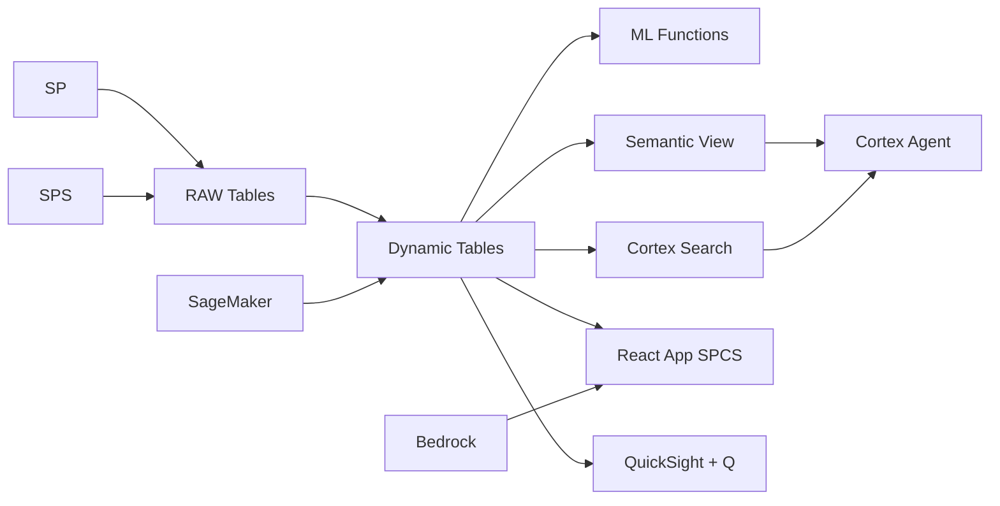

# Precision Agriculture Analytics

IoT-driven precision agriculture for Indonesian palm oil estates — ML.FORECAST predicts FFB yield per block, Dynamic Tables build real-time harvest dashboards, and Cortex AI generates agronomist recommendations.

## Architecture

An Indonesian palm oil group manages 800 blocks across 45,000 hectares, but yields average 15% below genetic potential. IoT sensors detect nutrient deficiencies and weather impacts in real time, but translating sensor data into agronomist decisions requires ML prediction and AI-generated recommendations at block level. The Rp 89 billion yield gap is the target.



## Snowflake Capabilities

| Capability | Implementation |
|-----------|---------------|
| Dynamic Tables | BLOCK_YIELD_PERFORMANCE / SOIL_NUTRIENT_STATUS / HARVEST_FORECAST_INPUT / FERTILIZER_ROI |
| ML Functions | ML.FORECAST + ML.ANOMALY_DETECTION |
| Cortex AI | COMPLETE, SUMMARIZE, AI_CLASSIFY |
| Cortex Search | 100 documents indexed |
| Cortex Agent | PRECISION_AG_AGENT |
| Semantic View | PRECISION_AG_ANALYTICS |
| React App (SPCS) | 5 tabs + DemoGuide |


## AWS Services

| Service | Role in Demo |
|---------|-------------|
| AWS IoT Core | Ingest real-time sensor data from plantation IoT devices |
| Amazon Timestream | Time-series storage for IoT sensor readings |
| Amazon SageMaker | Train yield prediction models from sensor and harvest data |
| AWS Glue | ETL for sensor data transformation and feature engineering |
| Amazon Bedrock (Claude) | Generate agronomist recommendations from yield and soil data |
| Amazon QuickSight + Q | Plantation operations dashboard with natural language queries |


## Personas

| Persona | Role | Key Questions |
|---------|------|---------------|
| **Ir. Agus Purnomo** | VP Plantation Operations | "Which blocks are underperforming their yield potential?" "What's the projected FFB yield for next quarter?" |
| **Dewi Kartika** | Estate Agronomist | "Which blocks need potassium supplementation?" "Show me the yield-weather correlation for Block K-12." |


## Data

| Table | Rows | Description |
|-------|------|-------------|
| BLOCKS | 800 | Plantation blocks with area, palm age, soil type, and GPS boundaries |
| IOT_SENSORS | 500,000 | Soil moisture, nutrient, and weather sensor readings from 800 blocks |
| HARVEST_RECORDS | 200,000 | Daily FFB harvest weights by block and harvester team |
| FERTILIZER_APPLICATIONS | 50,000 | Fertilizer type, quantity, and timing per block per round |
| PEST_DISEASE_REPORTS | 5,000 | Field scouting reports on pest and disease incidence |
| AGRONOMIST_DOCS | 100 | Agronomist field notes, soil analysis reports, and replanting studies |


## Build Instructions

### Prerequisites
- Snowflake account with ACCOUNTADMIN access
- Cortex AI enabled (ML Functions, Search, Agent)
- Warehouse: PRECISION_AG_WH (Medium)
- AWS CLI with access (us-west-2)

### Deployment

```bash
snowsql -f snowflake/00_setup.sql
snowsql -f snowflake/01_marketplace_install.sql
snowsql -f snowflake/02_raw_tables.sql
snowsql -f snowflake/03_staging.sql
snowsql -f snowflake/04_dynamic_tables.sql
snowsql -f snowflake/05_search.sql
snowsql -f snowflake/06_ml_models.sql
snowsql -f snowflake/07_semantic_view.sql
snowsql -f snowflake/08_agent.sql
```

### React App (SPCS)
```bash
cd app && npm ci && npm run build
docker build -t aws-indonesia-palm-oil-precision-ag-app .
docker push bdiqc8sm-default.registry.snowflakecomputing.com/palm_oil_precision_ag/app/aws_indonesia_palm_oil_precision_ag/app:latest
```

### Demo Mode
Open the app URL with `?demo=true` for presenter view.

## Build Modes

### Snowflake Only
Run scripts 00-08 (skip AWS-specific integration). Uses:
- **Snowpipe Streaming SDK** instead of AWS IoT Core
- **Dynamic Tables (time-series aggregation)** instead of Amazon Timestream
- **ML.FORECAST + ML.ANOMALY_DETECTION** instead of Amazon SageMaker
- **Dynamic Tables** instead of AWS Glue
- **Cortex Complete** instead of Amazon Bedrock (Claude)
- **Snowflake Intelligence (Cortex Analyst)** instead of Amazon QuickSight + Q

### Full AWS + Snowflake
Run all scripts including AWS integration. Deploy QuickSight dashboard from `quicksight/`.

## Business Impact

Industry research and Snowflake customer outcomes:
- **Indonesia has 16.4 million hectares of oil palm plantation — largest in the world** — [BPS Indonesia](https://www.bps.go.id/)
- **Precision agriculture can increase palm oil yields by 15-25% through targeted interventions** — [World Resources Institute](https://www.wri.org/)
- **IoT-enabled plantation monitoring reduces fertilizer waste by 20-30%** — [McKinsey Agriculture](https://www.mckinsey.com/industries/agriculture/our-insights)
- **Indonesian palm oil industry contributes 4.5% of GDP and employs 16 million people** — [GAPKI](https://gapki.id/)


## Key Demo Numbers

- **800 blocks** across 45,000 hectares in North Sumatra and Central Kalimantan
- **22.4 t/ha** average FFB yield (15% below 26.3t potential)
- **500,000 readings** IoT sensor data points from soil and weather sensors
- **Rp 89B** revenue opportunity from closing yield gap
- **23 blocks** predicted to decline without intervention


## License

Apache 2.0 — See [LICENSE](LICENSE) for details.

This is a personal demo project and is not an official Snowflake offering. It comes with no support or warranty.